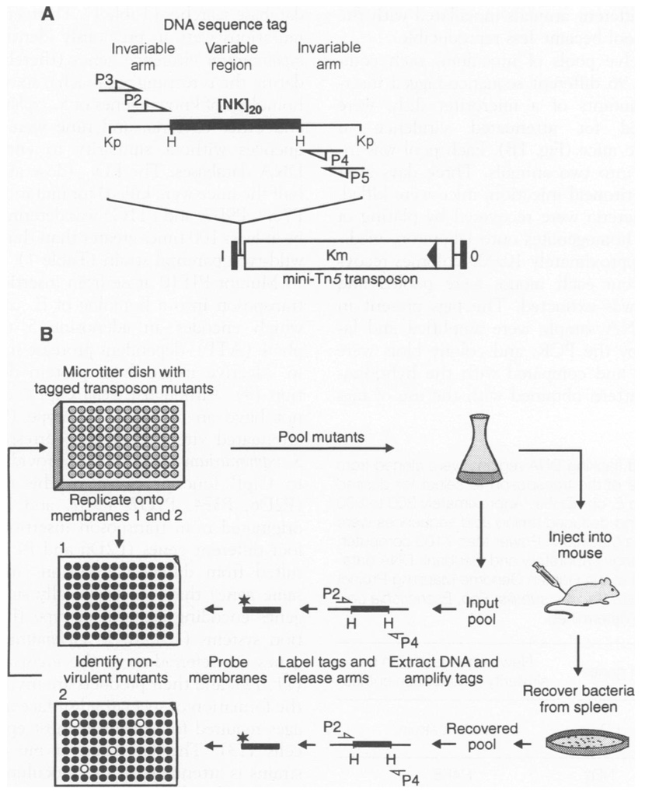
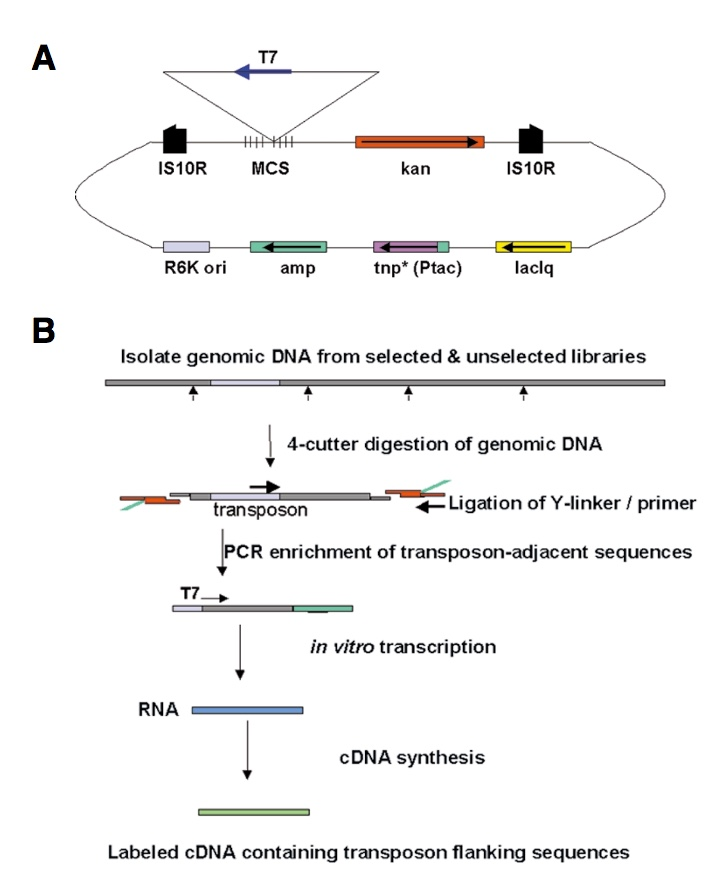

# History

Transposon sequencing is multiplex forward genetic analysis of bacterial genes in a competitive context.

## Signature-tagged mutagenesis (1995)

**Reference**

[Hensel M, Shea JE, Gleeson C, Jones MD, Dalton E, Holden DW. Simultaneous identification of bacterial virulence genes by negative selection. Science. 1995 Jul 21;269(5222):400-3. PubMed PMID: 7618105.](https://www.ncbi.nlm.nih.gov/pubmed/7618105)

As a result of the ability to assay multiple mutants in a multiplex fashion, the technique was widely adopted ([reviewed by Joan Mecsas](https://www.ncbi.nlm.nih.gov/pubmed/11834366)). However, there are a number of technical obstacles that limited the utility of the technique:
- Assay of at most 96 mutants in each assay (limited by the hybridization approach).
- Tedious library construction: each well is derived from a different transposon.
- Not quantitative.
- Radiolabeling is required for detection.

*So on to multiplex hybridization...!*

## Microarray-based detection of mutants (2001)

Two groups simultaneously described this. One called it TraSH (transposon-site hybridization); the other didn't name it.

**References**

[Badarinarayana V, Estep PW 3rd, Shendure J, Edwards J, Tavazoie S, Lam F, Church GM. Selection analyses of insertional mutants using subgenic-resolution arrays. Nat Biotechnol. 2001 Nov;19(11):1060-5. PubMed PMID: 11689852.](https://www.ncbi.nlm.nih.gov/pubmed/11689852)

[Sassetti CM, Boyd DH, Rubin EJ. Comprehensive identification of conditionally essential genes in mycobacteria. Proc Natl Acad Sci U S A. 2001 Oct 23;98(22):12712-7. Epub 2001 Oct 16. PubMed PMID: 11606763; PubMed Central PMCID: PMC60119.](https://www.ncbi.nlm.nih.gov/pubmed/11606763)

The microarray-based detection enabled quantitative analysis of mutant populations. "Version 2" analyses included doing suppressor screens in which mutagenesis in specific mutant backgrounds revealed [entire networks of regulators](https://www.ncbi.nlm.nih.gov/pubmed/17941710).

> TRASH REVIEW??

Limitations of the technique included:
- Designing the initial microarray and printing them for each experiment.
- Technical issues in microarray hybridization, including comparing array to array.

*To combat these challenges...*

## Transposon sequencing (2009-)

At least four different groups developed technology to identify transposon insertion sites via short-read sequencing.

> REVIEW ARTICLE
> DON'T FORGET THE 2008/2009 Salmonella article. Falkow?

Show figure of different types

## Variations on Tn-Seq

### Bar-seq

### Transposon sequencing is not expression analysis

Insert Marvin Whiteley paper.
