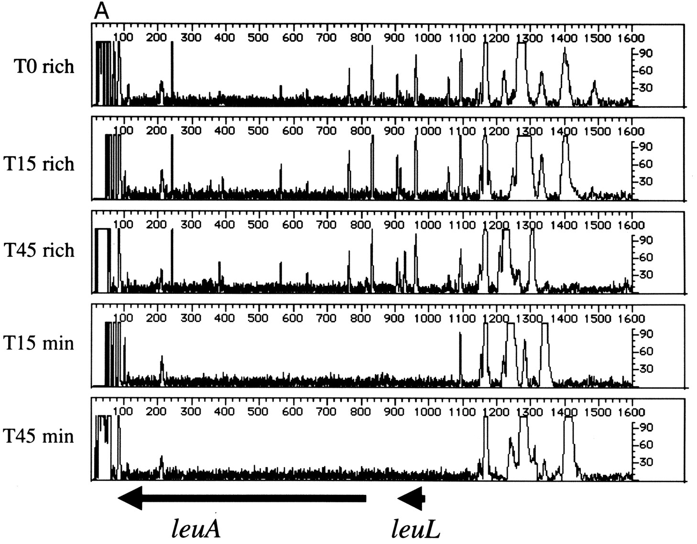

===================================================
History and Overview
===================================================

Transposon sequencing is multiplex forward genetic analysis of bacterial genes in a competitive context.

The key requirement for a successful transposon sequencing study is opportunity for growth of the mutant library.

Using the technique `Genetic Footprinting
<https://www.ncbi.nlm.nih.gov/pubmed/11160101>`__, it was shown that 15 generations is sufficient for mutants with a severe fitness defect to be effectively eliminated from detection:

Important to note that transposon sequencing defines genes/operons required under a given condition, not necessarily genes that are expressed at a high level under that condition. `These groups often do not overlap
<https://www.ncbi.nlm.nih.gov/pubmed/25057820>`__. This is worth thinking about in the context of the question you seek to answer.

.. toctree::

  history_stm
  history_microarray
  history_tnseq
  variations
