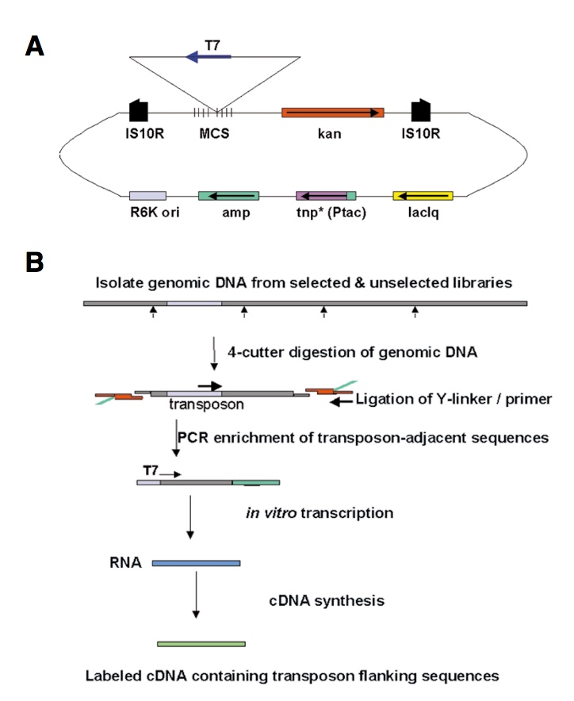
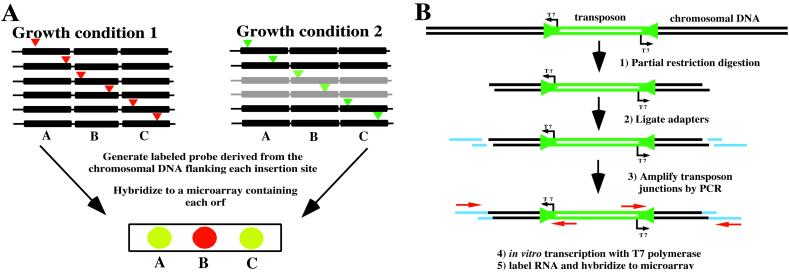

===================================================
Microarray Hybridization (2001)
===================================================

Two groups simultaneously described the. One called it TraSH (transposon-site hybridization); the other didn't name it.

-----

`Badarinarayana V, Estep PW 3rd, Shendure J, Edwards J, Tavazoie S, Lam F, Church GM. Selection analyses of insertional mutants using subgenic-resolution arrays. Nat Biotechnol. 2001 Nov;19(11):1060-5. PubMed PMID: 11689852
<https://www.ncbi.nlm.nih.gov/pubmed/11689852>`__

-----

`Sassetti CM, Boyd DH, Rubin EJ. Comprehensive identification of conditionally essential genes in mycobacteria. Proc Natl Acad Sci U S A. 2001 Oct 23;98(22):12712-7. Epub 2001 Oct 16. PubMed PMID: 11606763; PubMed Central PMCID: PMC60119.
<https://www.ncbi.nlm.nih.gov/pubmed/11606763>`__

-----

The microarray-based detection enabled quantitative analysis of mutant populations. The scalability of the approach enabled suppressor screens in which mutagenesis in specific mutant backgrounds revealed `entire networks of regulators
<https://www.ncbi.nlm.nih.gov/pubmed/17941710>`__

`Detailed methods have been published
<https://www.ncbi.nlm.nih.gov/pubmed/18392960>`__ for conducting the TraSH protocol. Furthermore, `additional variations
<https://www.ncbi.nlm.nih.gov/pubmed/17352919>`__ were developed later.

Limitations of the technique included designing and printing the microarray for each species/strain to be examined. Additionally, technical issues in microarray hybridization can present challenges.

*To combat these challenges...*

----

Next: :doc:`history_tnseq`
