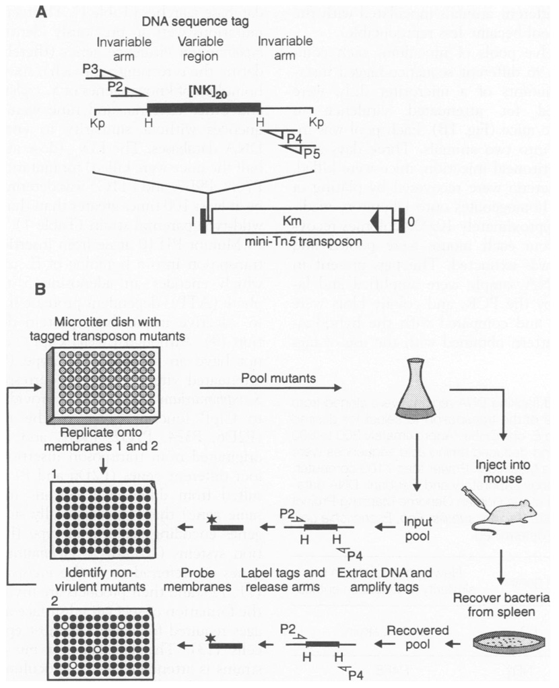

===================================================
Signature-tagged mutagenesis (1995)
===================================================

`Hensel M, Shea JE, Gleeson C, Jones MD, Dalton E, Holden DW. Simultaneous identification of bacterial virulence genes by negative selection. Science. 1995 Jul 21;269(5222):400-3. PubMed PMID: 7618105
<https://www.ncbi.nlm.nih.gov/pubmed/7618105>`__.

-----

As a result of the ability to assay multiple mutants in a multiplex fashion, the technique was widely adopted (`reviewed by Joan Mecsas
<https://www.ncbi.nlm.nih.gov/pubmed/11834366>`__). However, there are a number of technical obstacles that limited the utility of the technique:
- Assay of at most 96 mutants in each assay (limited by the hybridization approach).
- Tedious library construction: each well is derived from a different transposon.
- Not quantitative.
- Radiolabeling is required for detection.

*So on to multiplex hybridization...!*

----

Next: :doc:`history_microarray`
