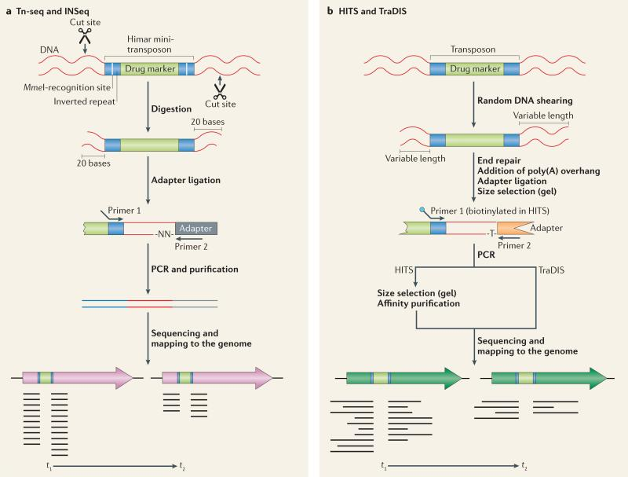
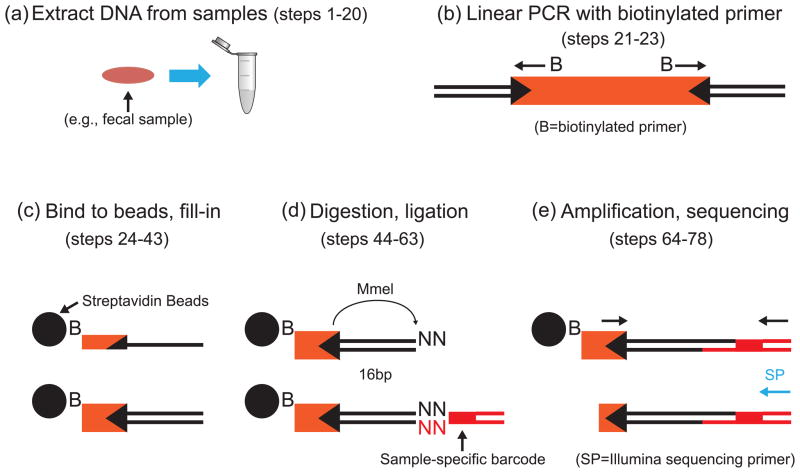

===================================================
Transposon Sequencing (2009)
===================================================

At least four different groups developed technology to identify transposon insertion sites via short-read sequencing. All of the technologies are widely adaptable to various organisms. There are differences in the type of tranpsoson used (mariner/Tn5) and method to enrich the transposon-chromsome junctions, but generally break down into two strategies (from `van Opijnen and Camilli 2003
<https://www.ncbi.nlm.nih.gov/pubmed/23712350>`__)

-----

Key references for INSeq, Tn-Seq etc.:

=====================================   ======
Discovery                               Notes
=====================================   ======
`Goodman et al. 2009`__                 INSeq (MmeI-based)
`van Opijnen and Camilli 2009`__        Tn-Seq (MmeI-based)
`Gawronski et al. 2009`__               HITS (MmeI-independent)
`Langridge et al. 2009`__               TraDIS (MmeI-independent)
`Gallagher et al. 2011`__               Circularization, RE-dependent
=====================================   ======

__ https://www.ncbi.nlm.nih.gov/pubmed/19748469
__ https://www.ncbi.nlm.nih.gov/pubmed/19767758
__ https://www.ncbi.nlm.nih.gov/pubmed/19805314/
__ https://www.ncbi.nlm.nih.gov/pubmed/19826075/
__ https://www.ncbi.nlm.nih.gov/pubmed/21253457

=====================================   ======
Review Articles                         Notes
=====================================   ======
`van Opijnen and Camilli 2003`__        Broad overview
`Chao et al. 2016`__                    Analysis of dense libraries, bottlenecks
`Kwon et al. 2016`__                    Studies using transposon sequencing
=====================================   ======

__ https://www.ncbi.nlm.nih.gov/pubmed/23712350
__ https://www.ncbi.nlm.nih.gov/pubmed/26775926
__ https://www.ncbi.nlm.nih.gov/pubmed/26476650

=====================================   ======
Methods                                 Notes
=====================================   ======
`Goodman et al. 2011`__                 Bead-based, detailed INSeq protocol.
=====================================   ======

__ https://www.ncbi.nlm.nih.gov/pubmed/22094732

-----

**For this workshop, we will focus on the Goodman & Gordon INSeq method, which is similar conceptually to the van Opijnen & Camilli Tn-Seq method.**

The INSeq library preparation method was first described in `2009
<https://www.ncbi.nlm.nih.gov/pubmed/19748469>`__ and was refined in `2011
<https://www.ncbi.nlm.nih.gov/pubmed/22094732>`__ to use a biotinylated linear amplification step. Subsequent molecular steps occur with the sample immobilized on a magnetic streptavidin bead, which enables reactions to be performed in a multiplexed fashion with a low volume of reagents.

----

Next: :doc:`variations`
