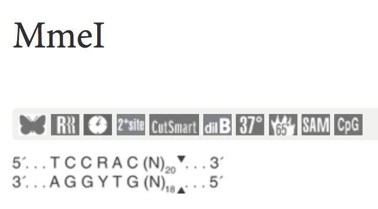
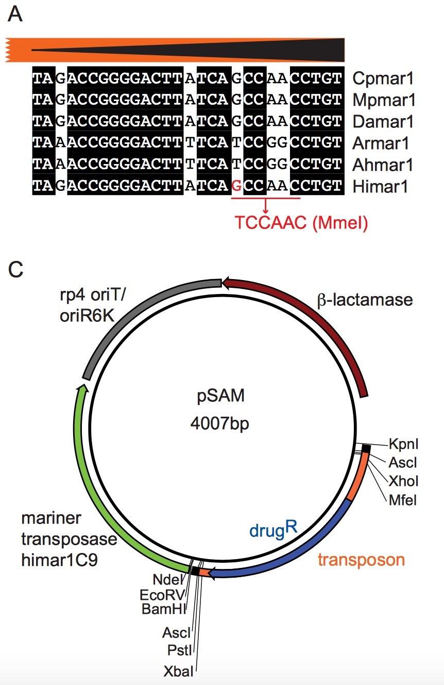

===================================================
Transposon selection
===================================================

We are focusing on the MmeI-based INSeq method, so the key feature will be using a transposon that includes MmeI restriction recognition sites oriented correctly at the ends of each transposon. Any transposon that fulfills this function will work. Goodman & Gordon (and independently, van Opijnen & Camilli) recognized that the MmeI type IIs restriction enzyme recognizes a site that is similar to the terminal repeat of mariner (Himar) type transposases. Mutation of a single base pair in the tranpsoson end enables recognition by MmeI. However, MmeI does not cleave at this sequence. Instead, `MmeI cleaves 20 bp away
<https://www.neb.com/products/r0637-mmei>`__, enabling capture of adjacent chromosomal sequence.

The pSAM base transposon was described by `Goodman et al. 2009
<https://www.ncbi.nlm.nih.gov/pubmed/19748469>`__.

-----

pMarVF1 was derived from pSAM and described in `Brooks et al. 2014
<https://www.ncbi.nlm.nih.gov/pubmed/25404340>`__. pMarVF1 will soon be available at `Addgene
<https://www.addgene.org/Mark_Mandel/>`__, and can be further modified as needed for other species and strains.

To illustrate the key changes needed to adapt it to a new organism, here we will describe the changes needed to convert *Bacteroides thetaiotaomicron* pSAM to *Vibrio fischeri* pMarVF1:

- The drug resistance cassette was replaced by a cassette that was known to function in *V. fischeri*.
- The approximately 300 bp promoter for the himar transposase was replaced by promoter from *V. fischeri*.

As long as the recipient strain is receptive to oriT-based conjugation from *E. coli*, then these modifications are likely to be sufficient to adapt the system to a new organism.

-----

Plasmid map
-----------------------------------------------

===============   ========================
Plasmid           Download of presumed map
===============   ========================
pMarVF1           :download:`Map <_files/pMarVF1_Map.gbk>`
===============   ========================

Cloning a new antibiotic-resistance cassette
-----------------------------------------------

Any antibiotic-resistance cassette (with promoter) can be cloned into the XhoI-XbaI fragment within the transposon in pMarVF1. Distal to the XbaI site are transcriptional terminators; so pointing the cassette toward XbaI (i.e., the 3' end of the resistance gene(s) at the XbaI end of the fragment) will result in a transposon that is likely to be polar, and may be bidirectionally polar.

Once the antibiotic cassette functions in the organism, different candidate promoters can be tested/screened/selected.

Cloning a new transposase promoter
-----------------------------------------------

A strong promoter from the species of interest (approximately 300 bp upstream of the ORF) can be cloned into the BamHI-NdeI fragment in pMarVF1. The NdeI side is proximal to the himar open reading frame.

For *B. thetaiotaomicron* and *V. fischeri* the promoter for the *rpoD* gene was used and worked well. pMarVF1 contains another promoter that was tested and exhibited slightly higher numbers of transconjugants in *V. fischeri* strain ES114.
