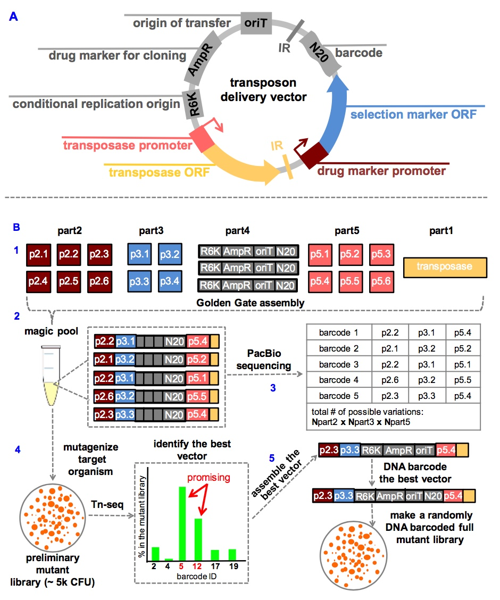

===================================================
Variations
===================================================

Variations in transposon preparation
---------------------------------------------------

In addition to the the basic mariner and Tn5 methods discussed earlier, there are other variations on this theme that have developed that we will discuss briefly.

Phage-based transposition in *Staphylococcus aureus* (2015)
~~~~~~~~~~~~~~~~~~~~~~~~~~~~~~~~~~~~~~~~~~~~~~~~~~~~~~~~~~~

Typically transposons are delivered to recipient cells by conjugation or by transformation. `Santiago et al.
<https://bmcgenomics.biomedcentral.com/articles/10.1186/s12864-015-1361-3>`__ adapted a phage-based transposition system to enable high efficiency tranposon delivery in *S. aureus*.

Magic pools (2017)
~~~~~~~~~~~~~~~~~~

Instead of using rationale design to tweak the antibiotic resistance and promoter, you can select for constructs that work better. This can be tricky as the plasmid is a suicide plasmid, so how do you know which construct gave you the best results? `This approach, which they term "magic pools"
<http://www.biorxiv.org/content/early/2017/07/03/158840>`__, seems to be an elegant way to tackle this issue.

   Lui 2017

Variations in library preparation
---------------------------------------------------

Each method has its own quirks. Even similar methods that rely on MmeI digestion have identified different ways to enrich for the chromosome-transposon junctions required for sequencing. Here are additional methods that extend conceptually beyond INSeq/Tn-Seq library preparation.

BarSeq (2015)
~~~~~~~~~~~~~

In the `BarSeq method
<http://mbio.asm.org/content/6/3/e00306-15.full>`__, elements of STM and Tn-Seq are combined for a powerful combination. The library is constructed with each transposon insertion containing a random section of 20 nucleotides (N20). First, the base library is characterized by typical Tn-Seq methods that identify the transposon insertions and also identify the 20mer for each insertion. In subsequent analyses, a simpler library preparation can be conducted (i.e., amplification and sequencing of the 20mer barcodes) to characterize library dynamics.

.. thumbnail:: images/wetmore_2015_fig1.jpg
   :width: 20%

Arrayed mutant libraries
---------------------------------------------------

Goodman et al. (2009)
~~~~~~~~~~~~~~~~~~~~~

Typically the transposon libraries from INSeq/Tn-Seq approaches have all of the mutants pooled together. However, for many applications in molecular biology it is very useful to have access to individual mutants. `Goodman et al.
<https://www.ncbi.nlm.nih.gov/pubmed/19748469>`__ devised an ingenious method to accomplish this. Mutants are first arrayed into 96-well microplates. Each mutant is then placed into a specific subset of 24 pools, and those pools are then analyzed by INSeq. The occurrence of a mutant in specific pools uniquely identifies its location in the original library. The only limitation of the method is that arraying the mutants into the pools requires a dedicated epMotion robot to ensure that mutants are faithfully placed in their assigned pools.

.. thumbnail:: images/goodman_2009_fig2.jpg
   :width: 20%

Knockout Sodoku (2016)
~~~~~~~~~~~~~~~~~~~~~

A similar combinatorial pooling approach was adapted to be conducted without a detailed robotic algorithm by `Baym et al.
<https://www.ncbi.nlm.nih.gov/pubmed/27830751>`__ in an approach they called "knockout sodoku". Samples are pooled across plates, rows, and columns. The authors used a 96-well multichannel pipet to pool small volumes from the original plates in a specified fashion.

.. thumbnail:: images/baym_2016_fig1.jpg
   :width: 20%
